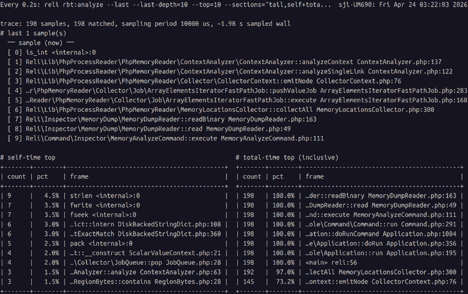
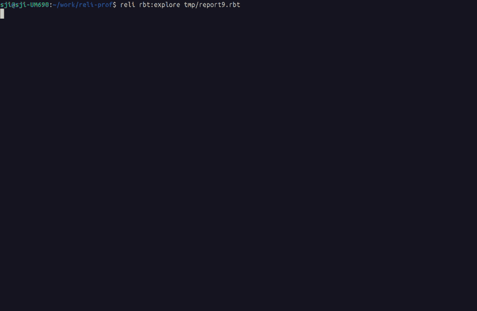
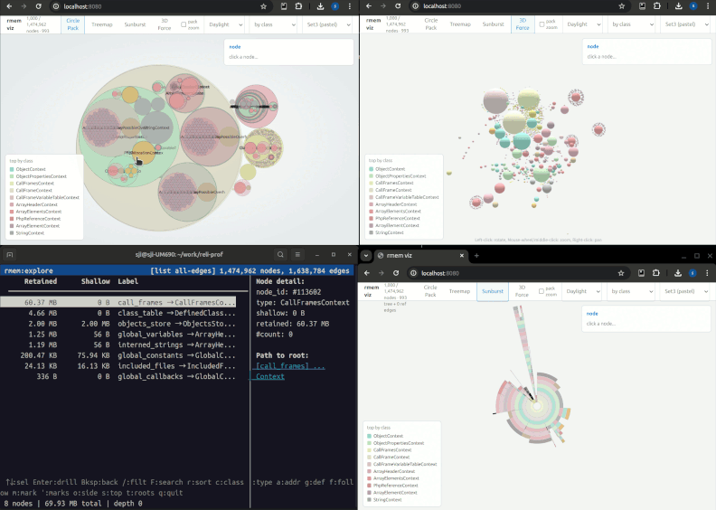
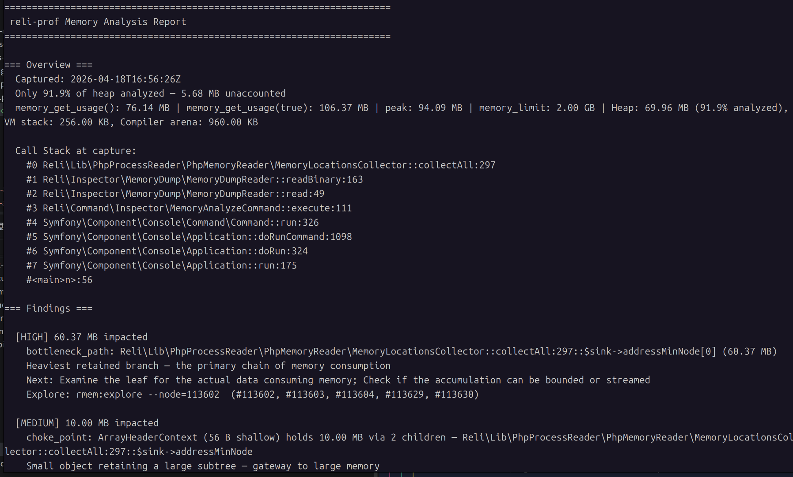

<h1 align="center">
  
</h1>


[](https://packagist.org/packages/reliforp/reli-prof)
[](https://github.com/reliforp/reli-prof/actions)
[](https://scrutinizer-ci.com/g/reliforp/reli-prof/?branch=0.12.x)
[](https://coveralls.io/github/reliforp/reli-prof?branch=0.12.x)


Reli is a sampling profiler (or a VM state inspector) written in PHP. It can read information about a running PHP script from outside the process. It's a standalone CLI tool, so target programs don't need any modifications.

Use it for call-trace sampling (where time is spent), memory-graph analysis (where memory is used), runtime variable inspection, and condition-triggered captures. For first-use, see [docs/getting-started.md](docs/getting-started.md); for the task map, see the [documentation index](docs/README.md).

## Showcase

A taste of what reli looks like in use.

### Sampling with a live hot-frames feed — `inspector:trace` + `watch rbt:analyze`

Capture to `.rbt` in one terminal while running `rbt:analyze` through `watch(1)` in another for a live-refreshing "top of the hot frames" view — the data streams in as samples are taken.

```bash
# Terminal A — capture (`-F rbt` is implied by the .rbt extension)
$ reli inspector:trace -p <pid> -o trace.rbt

# Terminal B — live analysis, refreshed every 0.2 seconds
$ watch -n0.2 'reli rbt:analyze --last --last-depth=10 --top=10 --sections="tail,self+total" --crop-anchor=right --path=short --crop=auto < trace.rbt'
```

<p align="center">
  
</p>

**What you're looking at.** reli is a *sampling* profiler — every ~10 ms it takes a snapshot of the target's PHP call stack. The top pane is what the target is running *right now*. The self / total tables below rank frames by how many accumulated snapshots they've appeared in: more appearances = more wall time spent there. *Self* is time directly in the frame; *Total* is time in the frame **plus** anything it called.

**Compact enough to leave running.** At default 10 ms sampling, an hour of trace is rarely more than a few MB of `.rbt` — capture now, analyse later.

Analyser reference: [docs/tracing/rbt-analyze-and-explore.md](docs/tracing/rbt-analyze-and-explore.md)

### Interactive trace browsing — `rbt:explore`

Capture to `.rbt`, open the sandwich / flamegraph / tree TUI.

```bash
$ reli inspector:trace -p <pid> -o trace.rbt
$ reli rbt:explore trace.rbt
```

<p align="center">
  
</p>

Full tour (keymap, filters, `--with-opcode`, mouse, live tail): [docs/tracing/rbt-analyze-and-explore.md](docs/tracing/rbt-analyze-and-explore.md)<br>
`.rbt` format spec and `converter:*` outputs (flamegraph, speedscope, pprof, callgrind, folded, phpspy): [docs/tracing/binary-trace-format.md](docs/tracing/binary-trace-format.md)<br>
Advanced capture (opcodes / native frames / JIT): [docs/tracing/advanced-capture.md](docs/tracing/advanced-capture.md)

### Memory graph visualization — `rmem:viz` / `rmem:explore`

Render the heap as a standalone HTML file — Circle Pack, Treemap, Sunburst, 3D Force — or serve it live with a shared focus bus that `rmem:explore` (TUI), browsers, and an MCP client all follow in sync.

```bash
# Capture a snapshot first (one-shot; or use inspector:memory:dump + inspector:memory:analyze in production — see docs/memory/memory-dump.md)
$ reli inspector:memory -p <pid> -f binary -o snapshot.rmem

# Standalone HTML
$ reli rmem:viz snapshot.rmem
# wrote snapshot.rmem.viz.html

# Live (HTTP/SSE) with follow-from-TUI
$ reli rmem:explore snapshot.rmem --http-bridge 8080
# press `f` in the TUI, then open http://127.0.0.1:8080/
```

<p align="center">
  
</p>

**What you're looking at.** reli walks the target's PHP heap into a graph — every value (objects, arrays, strings, call frames…) is a node, every reference is an edge. `rmem:viz` renders that graph as a standalone HTML page; `rmem:explore --http-bridge` (or the standalone `rmem:live`) serves it over HTTP with a shared cursor that the terminal TUI, browser views, and an MCP client all follow at once. Useful for chasing memory leaks and finding which classes eat the most memory.

Full tour (views, palettes, focus bus, mouse, MCP): [docs/memory/rmem-explore-and-serve.md](docs/memory/rmem-explore-and-serve.md)

### Automated memory findings — `inspector:memory:report`

Capture a snapshot and get a prioritised report back — dominant classes, cycles, choke points, deduplication candidates — each with severity, hypothesis, and next steps.

```bash
$ reli inspector:memory -p <pid> -f binary -o snapshot.rmem
$ reli inspector:memory:report snapshot.rmem
```

<p align="center">
  
</p>

**What you're looking at.** reli scans the captured heap graph for known waste patterns — dominant classes, reference cycles, choke points, dedup candidates — and prints each finding with a severity, a hypothesis, and a next-investigation step.

You can also compare two snapshots to track regressions or verify fixes:

```bash
$ reli inspector:memory:compare before.rmem after.rmem
```

Full reference (output formats, thresholds, JSON mode): [docs/memory/memory-report.md](docs/memory/memory-report.md)<br>
Capture options (`--exclude-heap`, portable dumps, core-file analysis): [docs/memory/memory-dump.md](docs/memory/memory-dump.md), [docs/memory/coredump.md](docs/memory/coredump.md)

## Troubleshooting

Common hitches (non-standard `php` binary name, `-S` for accuracy, Amazon Linux 2 memory maps, stale analysis cache): [docs/troubleshooting.md](docs/troubleshooting.md).

## How it works

Under the hood, reli:

- Parses the ELF binary of the PHP interpreter.
- Reads the target's memory map from `/proc/<pid>/maps`.
- Reads memory of the outer process through `ptrace(2)` and `process_vm_readv(2)` via FFI.
- Analyses the internal data structures of the PHP VM (aka Zend Engine).

This keeps target-side overhead low in our benchmarks: 1.00–1.06× baseline at typical sampling rates, with profiler CPU spent in the separate reli process. See [docs/bench/RESULTS.md](docs/bench/RESULTS.md) for the numbers.

## Goals
We would like to achieve the following 5 goals through this project.

- To be able to closely observe what is happening inside a running PHP script.
- To be a framework for PHP programmers to create a freely customizable PHP profiler.
- To be experimentation for the use of PHP outside of the web, where recent improvements of PHP like JIT and FFI have opened the door.
- Another entry point for PHP programmers to learn about PHP's internal implementation.
- To create a program that remains fun for us to write, even as AI coding agents become part of how we build software.

## LICENSE
- MIT (mostly)
- tools/flamegraph/flamegraph.pl is copied from https://github.com/brendangregg/FlameGraph and licenced under the CDDL 1.0. See tools/flamegraph/docs/cddl1.txt and the header of the script.
- Some C headers defining internal structures are extracted from php-src. They are licensed under the Zend Engine License or the PHP License. See src/Lib/PhpInternals/Headers . So here are the words required by the Zend Engine License and the PHP License.
```
This product includes the Zend Engine, freely available at
     http://www.zend.com
```

```
This product includes PHP software, freely available from
     <http://www.php.net/software/>
```

## What does the name "Reli" mean?
Given its functionality, you might naturally think that the name stands for "Reverse Elephpantineer's Lovable Infrastructure". But unfortunately, it's not true.

"Reli" means nothing, though you are free to think of this tool as something reliable, religious, relishable, or whatever other reli-s you like.

Initially, the name of this tool was just "php-profiler".
Due to a licensing problem ([#175](https://github.com/reliforp/reli-prof/issues/175)), this perfectly good name had to be changed.

So we applied a randomly chosen string manipulation function to the original name. `strrev('php-profiler')` results in `'reliforp-php'`, and it can be read as "reli for p(php)".

Thus, the name of this tool is "Reli for PH*" now. And you can also just call it "Reli".

## See also
- [adsr/phpspy](https://github.com/adsr/phpspy) — Reli is heavily inspired by phpspy. For how the two differ and when to reach for which, see [docs/comparison.md](docs/comparison.md).
