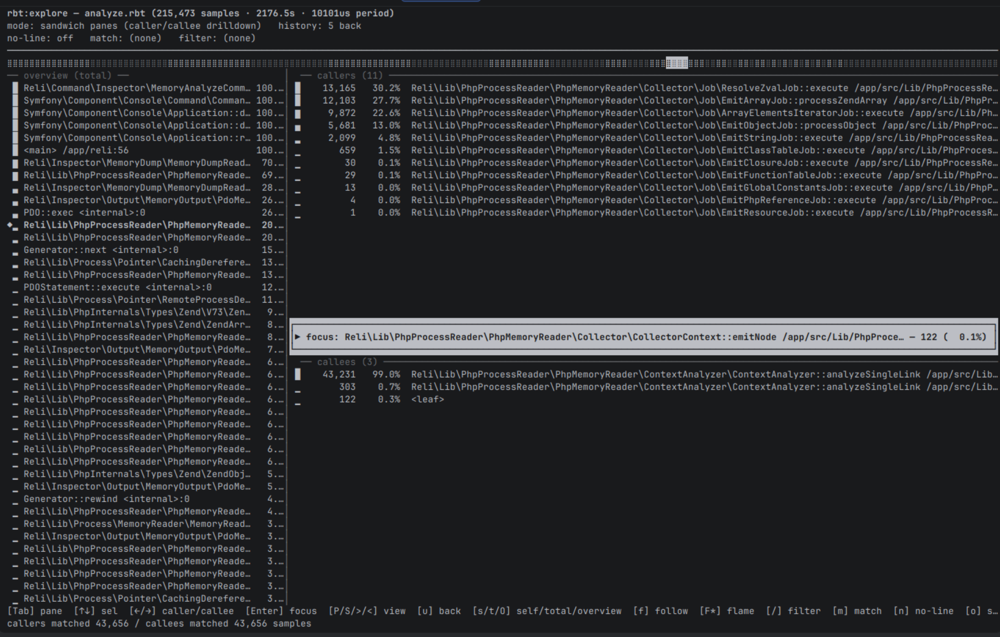

# Reli

[](https://packagist.org/packages/reliforp/reli-prof)
[](https://github.com/reliforp/reli-prof/actions)
[](https://scrutinizer-ci.com/g/reliforp/reli-prof/?branch=0.12.x)
[](https://coveralls.io/github/reliforp/reli-prof?branch=0.12.x)


Reli is a sampling profiler (or a VM state inspector) written in PHP. It can read information about running PHP script from outside of the process. It's a stand alone CLI tool, so target programs don't need any modifications. The former name of this tool was sj-i/php-profiler. 

New here? [docs/getting-started.md](docs/getting-started.md) walks from install to your first trace. Looking for a specific task? The [documentation index](docs/README.md) maps "I want to X" to the right command and doc.

## What can I use this for?

- **Where time is spent** — sampling profiler for PHP call stacks, with optional C-level frames and per-opcode detail. Capture to the compact `.rbt` binary format, browse in the `rbt:explore` TUI, or convert to speedscope / pprof / flamegraph / callgrind / folded.
- **Where memory is used** — reconstruct the target's PHP heap into a queryable graph (`.rmem`). Open it interactively with `rmem:explore` (TUI), `rmem:viz` (standalone HTML — Pack / Treemap / Sunburst / 3D Force) or `rmem:live` (HTTP/SSE so TUI / browsers / AI share one focus); get a prioritised findings report with `memory:report`, or compare two snapshots with `memory:compare` to track regressions.
- **What values flow through** — read PHP variable values from a running process without modifying it (`inspector:peek-var`), or attach variable values to every trace sample (`inspector:trace --trace-var`) so you can join runtime state to hot stacks.
- **When something goes wrong** — trigger captures on runtime conditions. `inspector:watch` takes a memory dump or trace when memory thresholds, function calls, or variable conditions are met. `inspector:sidecar` accepts on-demand dump requests from the app over a Unix socket — ideal for `memory_limit` crash analysis.

For the full catalogue of tasks and commands, see the [documentation index](docs/README.md).

## Showcase

A taste of what reli looks like in use. For the full walkthroughs, follow each showcase's link. For step-by-step first-use, see [docs/getting-started.md](docs/getting-started.md).

### Interactive trace browsing — `rbt:explore`

Capture to `.rbt`, open the sandwich / flame / tree TUI.

```bash
$ sudo php ./reli inspector:trace -p <pid> -F rbt -o trace.rbt
$ ./reli rbt:explore trace.rbt
```



Full tour (keymap, filters, `--with-opcode`, mouse, live tail): [docs/tracing/rbt-analyze-and-explore.md](docs/tracing/rbt-analyze-and-explore.md). Format spec and converters: [docs/tracing/binary-trace-format.md](docs/tracing/binary-trace-format.md). Advanced capture (opcodes / native frames / JIT): [docs/tracing/advanced-capture.md](docs/tracing/advanced-capture.md).

### Memory graph visualization — `rmem:viz` / `rmem:live`

Render the heap as a standalone HTML file — Circle Pack, Treemap, Sunburst, 3D Force — or serve it live with a shared focus bus that `rmem:explore` (TUI), browsers, and an MCP client all follow in sync.

```bash
# Standalone HTML
$ php ./reli rmem:viz snapshot.rmem
# wrote snapshot.rmem.viz.html

# Live (HTTP/SSE) with follow-from-TUI
$ php ./reli rmem:explore snapshot.rmem --http-bridge 8080
# press `f` in the TUI, then open http://127.0.0.1:8080/
```

<!-- TODO(screenshot): rmem:viz 3D Force graph of a real heap -->


<!-- TODO(screenshot): rmem:viz Circle Pack of a real heap -->


<!-- TODO(gif): rmem:explore ↔ rmem:live focus bus — moving the TUI cursor moves the browser highlight -->


Full tour (views, palettes, focus bus, mouse, MCP): [docs/memory/rmem-explore-and-serve.md](docs/memory/rmem-explore-and-serve.md).

### Automated memory findings — `memory:report`

Capture a snapshot and get a prioritised report back — dominant classes, cycles, choke points, deduplication candidates — each with severity, hypothesis, and next steps.

```bash
$ sudo php ./reli inspector:memory -p <pid> -f binary -o snapshot.rmem
$ php ./reli inspector:memory:report snapshot.rmem
```

<!-- TODO(screenshot): memory:report terminal output (findings + tables) -->


Compare two snapshots to track regressions or verify fixes:

```bash
$ php ./reli inspector:memory:compare before.rmem after.rmem
```

Full reference (output formats, thresholds, JSON mode): [docs/memory/memory-report.md](docs/memory/memory-report.md). Capture options (`--exclude-heap`, portable dumps, core-file analysis): [docs/memory/memory-dump.md](docs/memory/memory-dump.md), [docs/memory/coredump.md](docs/memory/coredump.md).

### Flamegraph from a `.rbt`

```bash
$ ./reli converter:flamegraph <trace.rbt >flame.svg
```


Also available: `converter:speedscope`, `converter:pprof`, `converter:callgrind`, `converter:folded`, `converter:phpspy`, `rbt:recover`. See [docs/tracing/binary-trace-format.md](docs/tracing/binary-trace-format.md).

## Troubleshooting
### I get an error message "php module not found" and can't get a trace!
If your PHP binary uses a non-standard binary name that does not end with `/php`, use the `--php-regex` option to specify the name of the executable (or shared object) that contains the PHP interpreter.

### I don't think the trace is accurate.
The `-S` option will give you better results. Using this option stops the execution of the target process for a moment at every sampling, but the trace obtained will be more accurate. If you don't stop the VMs from running when profiling CPU-heavy programs such as benchmarking programs, you may misjudge the bottleneck, because you will miss more VM states that transition very quickly and are not detected well.

### I can't get traces on Amazon Linux 2.
First, try `cat /proc/<pid>/maps` to check the memory map of the target PHP process. If the first module does not indicate the location of the PHP binary and looks like an anonymous region, try to specify `--php-regex="^$"` as an option.

## How it works

Under the hood, reli:

- Parses the ELF binary of the PHP interpreter.
- Reads the target's memory map from `/proc/<pid>/maps`.
- Reads memory of the outer process through `ptrace(2)` and `process_vm_readv(2)` via FFI.
- Analyses the internal data structures of the PHP VM (aka Zend Engine).

If you have a bit of extra CPU resource to spare on the profiling host, the overhead of this software is negligible.

## Differences to phpspy, when to use reli

Reli started out heavily inspired by [adsr/phpspy](https://github.com/adsr/phpspy); several things have since diverged.

The main structural difference is that reli is written in almost pure PHP while phpspy is written in C. If you want to customise *what* and *how* information is captured, doing it in PHP is easier — at some performance cost. (Though we aim to keep that cost modest.)

Reli can also find VM state from ZTS interpreters: daemon-mode traces of threads started via [ext-parallel](https://github.com/krakjoe/parallel) are captured automatically, which phpspy alone cannot do. `inspector:eg` exposes just the EG address so that you can feed it to phpspy manually for ZTS targets, and the [hybrid phpspy mode](docs/tracing/phpspy-hybrid.md) (`phpspy:trace` / `phpspy:daemon`) combines reli's ZTS-aware EG resolution with phpspy's fast C-based tracing.

Other capabilities reli currently has that phpspy doesn't:

- More accurate line numbers.
- Output format customisation via PHP templates.
- Running-opcode output for each sample.
- Automatic PHP-version detection from stripped binaries.
- Compact binary trace format (`.rbt`) plus speedscope / pprof / folded / callgrind / flamegraph converters (see [docs/tracing/binary-trace-format.md](docs/tracing/binary-trace-format.md)).
- Deep memory-graph analysis of the target process.
- Merged native (C-level) stack traces via DWARF `.eh_frame` unwinding.
- JIT-compiled function-name resolution via perf map / GDB JIT interface.

Nothing above is technically unreachable from phpspy — these may land there one day.

On the other hand, phpspy still wins on raw sampling throughput and overhead. Much of what phpspy uniquely does will be covered by reli eventually.

## Goals
We would like to achieve the following 5 goals through this project.

- To be able to closely observe what is happening inside a running PHP script.
- To be a framework for PHP programmers to create a freely customizable PHP profiler.
- To be experimentation for the use of PHP outside of the web, where recent improvements of PHP like JIT and FFI have opened the door.
- Another entry point for PHP programmers to learn about PHP's internal implementation.
- To create a program that is fun to write for me.

## LICENSE
- MIT (mostly)
- tools/flamegraph/flamegraph.pl is copied from https://github.com/brendangregg/FlameGraph and licenced under the CDDL 1.0. See tools/flamegraph/docs/cddl1.txt and the header of the script.
- Some C headers defining internal structures are extracted from php-src. They are licensed under the Zend Engine License or the PHP License. See src/Lib/PhpInternals/Headers . So here are the words required by the Zend Engine License and the PHP License.
```
This product includes the Zend Engine, freely available at
     http://www.zend.com
```

```
This product includes PHP software, freely available from
     <http://www.php.net/software/>
```

## What does the name "Reli" mean?
Given its functionality, you might naturally think that the name stands for "Reverse Elephpantineer's Lovable Infrastructure". But unfortunately, it's not true.

"Reli" means nothing, though you are free to think of this tool as something reliable, religious, relishable, or whatever other reli-s you like.

Initially, the name of this tool was just "php-profiler".
Due to a licensing problem ([#175](https://github.com/reliforp/reli-prof/issues/175)), this simple good name had to be changed.

So we applied a randomly chosen string manipulation function to the original name. `strrev('php-profiler')` results to `'reliforp-php'`, and it can be read as "reli for p(php)".

Thus, the name of this tool is "Reli for PH*" now. And you can also call it just "Reli".

## See also
- [adsr/phpspy](https://github.com/adsr/phpspy)
    - Reli is heavily inspired by phpspy.
