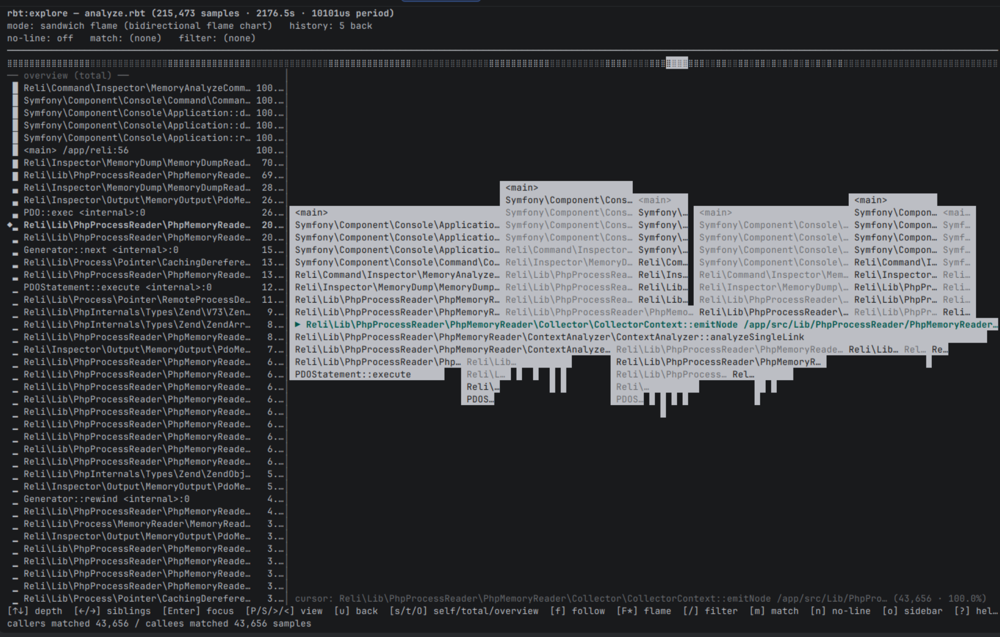
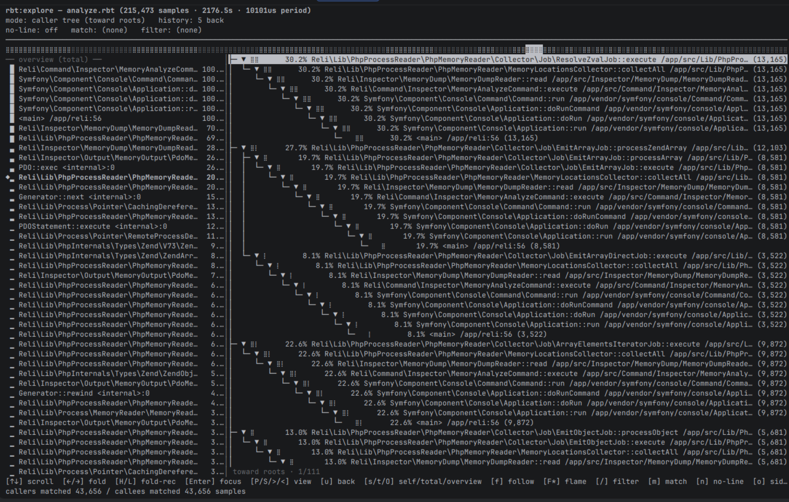
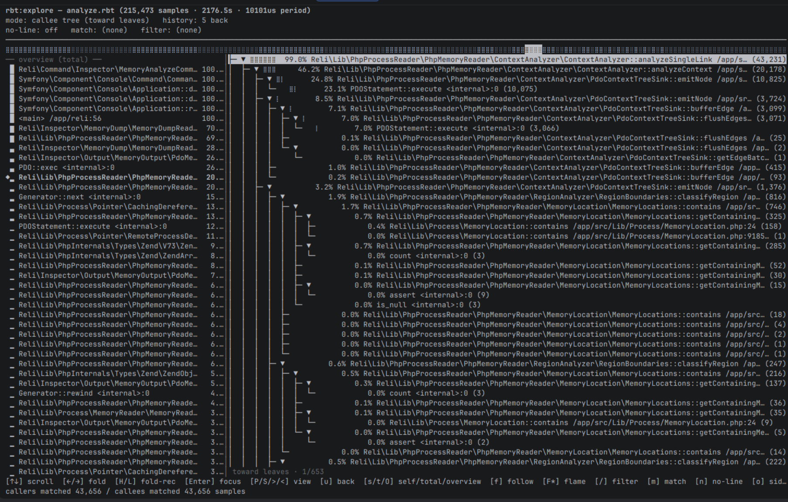

# Analyzing `.rbt` traces — `rbt:analyze` and `rbt:explore`

Once you've captured a binary trace into a `.rbt` file, reli ships two
commands for poking at it without leaving the terminal. For capture
commands and options, see [capturing-traces.md](capturing-traces.md);
for the on-disk format, see [binary-trace-format.md](binary-trace-format.md).

| Command | Use it for |
|---|---|
| **`rbt:analyze`** | One-shot text reports: hot frames, callers/callees of a regex, the last few sample stacks. Reads from stdin so it pipes well into shell scripts and AI assistants. |
| **`rbt:explore`** | Interactive TUI: drill into the trace with arrow keys, switch between flame / panes / tree views, set filters live. Loads the whole trace into memory once. |

Both commands read raw `.rbt` and `.rbt.gz` (gzip is auto-detected) and
do all of their work locally — no SQL, no temp files, no network.

If you want a longer-form story about *why* these exist as a pair
(speedscope-style flamegraphs vs. agent-friendly text), see
[binary-intermediate-format.md](../internals/binary-intermediate-format.md).

---

## Capturing a trace first

Any of reli's `.rbt`-emitting modes produce input these commands can
read:

```bash
# inspector:trace, single .rbt file (rbt format is auto-selected from the .rbt extension)
sudo ./reli inspector:trace -p <pid> -o trace.rbt

# inspector:daemon, one .rbt per worker
sudo ./reli inspector:daemon -P "^php-fpm" --output-format=rbt -o /tmp/traces/

# Same daemon mode, gzipping each completed segment
sudo ./reli inspector:daemon -P "^php-fpm" --output-format=rbt --rbt-compress -o /tmp/traces/
```

You can also convert from any other trace format reli understands:

```bash
./reli converter:rbt < trace.txt > trace.rbt
./reli converter:rbt --compress < trace.txt > trace.rbt.gz
```

If a file got truncated (writer killed mid-segment, disk full, etc.),
recover what's still readable with `rbt:recover`:

```bash
./reli rbt:recover < broken.rbt > recovered.rbt
```

---

## `rbt:analyze` — one-shot text reports

`rbt:analyze` aggregates a trace into hot-frame and call-site tables.
It always reads from stdin, so the standard pattern is:

```bash
./reli rbt:analyze < trace.rbt
./reli rbt:analyze < trace.rbt.gz       # gzip auto-detected
zcat trace.rbt.gz | ./reli rbt:analyze  # equivalent
```

Sample output (truncated):

```
trace: 18432 samples, 18432 matched, sampling period 10000 us, ~184.32 s sampled wall

# self-time top
 ------- ------- -----------------------------------------------------------
  count   pct     frame
 ------- ------- -----------------------------------------------------------
  4521    24.5%  PDO::query /var/www/src/Db.php:142
  3018    16.4%  preg_match /var/www/src/Router.php:88
  ...

# total-time top (inclusive)
 ------- ------- -----------------------------------------------------------
  count   pct     frame
 ------- ------- -----------------------------------------------------------
  18105   98.2%  <main> /var/www/public/index.php:0
  17988   97.6%  Symfony\...\HttpKernel::handle ...
  ...
```

### Common recipes

**See where a specific function's time goes** — list the immediate
callers of every frame matching a regex. Note that PHP namespace
separators are literal backslashes; in PCRE that's `\\`, and inside
shell single-quotes you type two of them:

```bash
./reli rbt:analyze --callers='Doctrine\\ORM\\EntityManager::flush' < trace.rbt
```

**See what a specific function spends its time on** — list the
immediate callees:

```bash
./reli rbt:analyze --callees='App\\Repository\\UserRepository::find' < trace.rbt
```

**Drop framework noise** — strip frames matching a regex from each
stack *before* counting, so the rankings reflect application code:

```bash
./reli rbt:analyze --hide='^Symfony\\|^Laminas\\|^vendor/' < trace.rbt
```

**Only count samples touching a region** — keep samples whose stack
contains a matching frame and skip the rest entirely:

```bash
./reli rbt:analyze --match='OrderController' < trace.rbt
```

**Group by function name only** (collapse `file:line` so all calls to
the same function aggregate together):

```bash
./reli rbt:analyze --no-line < trace.rbt
```

**Tail an in-progress trace** to see what the target is doing *right
now*. `--last` (or `--last=N`) prints the most recent sample stacks
in oldest-first order, with `(now)` marking the latest entry — useful
for live tailing while a long-running script chugs along:

```bash
./reli rbt:analyze --last=5 < trace.rbt

...self/total tables...

# last 5 sample(s)
  ── sample (4 ago) ──
  [ 0] PDO::query /var/www/src/Db.php:142
  [ 1] App\Repository\UserRepository::find /var/www/src/UserRepository.php:18
  ...
  ── sample (now) ──
  [ 0] sleep <internal>:-1
  [ 1] App\Worker::loop /var/www/src/Worker.php:42
```

`--last` alone defaults to 1, `--last=N` keeps a ring buffer of N.
The tail prints after the aggregation tables so `watch` shows the
(fixed-size) tables anchored at the top and lets the variable-depth
stack sit at the bottom of the screen.

**Stabilise the layout under `watch`** — the stack depth of each
sample varies and can jitter the rest of the display. Three levers,
usable together:

```bash
# Cap every tail stack at 5 leaf-most frames.
watch './reli rbt:analyze --last --last-depth=5 --top=5 < trace.rbt'

# Drop the directory portion of every file path ('Worker.php:42')
# and hard-clip each line to the terminal width so a stray 200-char
# FQN doesn't wrap-break the layout.
./reli rbt:analyze --last=5 --path=short --crop=auto < trace.rbt
```

`--path` is display-only — aggregation still keys on the full path, so
two files with the same basename stay distinct in the self/total
counts.

By default `--crop` keeps the head of each frame and puts the
ellipsis on the right. For deep-namespace frames like
`Reli\Inspector\MemoryDump\FastPath\RegionByteProvider::regionBytes`
that can hide the leaf; flip the anchor with `--crop-anchor=right`
to keep the class/method/file instead:

```bash
./reli rbt:analyze --last=5 --path=short --crop=auto --crop-anchor=right < trace.rbt
```

Frames are cropped *before* going into the table, so Symfony's
auto-sized borders stay intact either way.

**Rearrange and side-by-side** — the `--sections` flag controls both
the order of the report and whether sections stack or sit next to
each other. `,` separates rows, `+` joins columns within a row:

```bash
# self/total side by side on top, the tail full-width below:
./reli rbt:analyze --last=5 --sections='self+total,tail' < trace.rbt

# three columns, tail at the right — trades vertical space for width:
./reli rbt:analyze --last=5 --sections='self+total+tail' \
  --path=short --crop=auto < trace.rbt
```

Known section names: `self`, `total`, `callers`, `callees`, `tail`.
Sections that wouldn't have content this run (e.g. `callers` with no
`--callers=` pattern) are silently skipped.

**Suppress the default tables** (e.g. when you only want a callers
view, no top-N noise) with `--top=0`:

```bash
./reli rbt:analyze --top=0 --callers='SomeClass::method' < trace.rbt
```

### Option reference

| Option | Default | Description |
|---|---|---|
| `--top=N` | `20` | Rows per table. `0` suppresses the default self/total tables. |
| `--last[=N]` | off | Print the last N sample stacks (default 1). |
| `--last-depth=N` | `0` | Cap each `--last` stack at N leaf-most frames (`0` = no cap). Tail-only; doesn't affect aggregation. |
| `--callers=PATTERN` | — | Show callers of frames matching this PCRE pattern (no delimiters needed). |
| `--callees=PATTERN` | — | Show callees of frames matching this PCRE pattern. |
| `--match=PATTERN` | — | Only count samples whose stack contains a matching frame. |
| `--hide=PATTERN` | — | Drop frames matching this PCRE pattern from each stack *before* counting. |
| `--no-line` | off | Group frames by function name only (ignore `file:line`). |
| `--path=MODE` | `full` | `full` keeps the whole path; `short` displays only `basename:line`. Display-only. |
| `--crop=N\|auto` | `0` | Hard-clip each frame at N chars (or the terminal width per column with `auto`). Tables keep their borders — the crop applies to the frame column only. |
| `--crop-anchor=left\|right` | `left` | Which end of the frame `--crop` preserves. `left` keeps the head (namespace); `right` keeps the leaf (class + method + file). |
| `--sections=SPEC` | `self,total,callers,callees,tail` | Layout spec. `,` stacks rows, `+` lays sections side by side. |

All `*=PATTERN` flags take a raw PCRE regex without delimiters; reli
wraps them in `#…#` internally.

### Why text reports

The text reports were built deliberately so coding agents (and
shell-script users) can read a trace without a UI: pipe a `.rbt`
through `rbt:analyze`, drop the result into the agent's context,
ask it to find the hotspot. The output stays small even on large
captures, and `--top`/`--match`/`--callers` give the agent a
lightweight query language to drill in further.

If you'd rather scroll a flame chart by hand, jump to `rbt:explore`
below.

---

## `rbt:explore` — interactive TUI

`rbt:explore` opens a full-screen explorer for a `.rbt` file. The
trace is loaded into memory once at startup; everything after that —
filters, focus changes, view switches — is recomputed in-process
without re-reading the file.

```bash
./reli rbt:explore trace.rbt
./reli rbt:explore trace.rbt.gz   # gzip auto-detected
```

Loading a trace prints how big it is and how many samples landed:

```
loading trace.rbt ...
loaded 1,842,000 samples (184.2s sampled wall, 100-us period)
```

After that you're in a sandwich-style explorer modelled loosely on
[speedscope](https://www.speedscope.app/)'s sandwich view.

### Screenshots

Click any thumbnail for the full-size image.

<table>
  <tr>
    <td align="center" width="50%">
      <a href="../images/rbt-explore-panes.png">
        
      </a>
      <br>
      <sub><b>Panes view</b></sub>
    </td>
    <td align="center" width="50%">
      <a href="../images/rbt-explore-flame.png">
        
      </a>
      <br>
      <sub><b>Flame view</b></sub>
    </td>
  </tr>
  <tr>
    <td align="center" width="50%">
      <a href="../images/rbt-explore-callers-tree.png">
        
      </a>
      <br>
      <sub><b>Callers tree view</b></sub>
    </td>
    <td align="center" width="50%">
      <a href="../images/rbt-explore-callees-tree.png">
        
      </a>
      <br>
      <sub><b>Callees tree view</b></sub>
    </td>
  </tr>
</table>

### Layout at a glance

```
┌──────────────────────────── header ──────────────────────────────┐
│ trace: 1,842,000 samples · 184.2s sampled · self-time            │
├──────────────────────────────────────────────────────────────────┤
│ mini-flame strip (1 row)                                         │
├──────────────────────────────────────────────────────────────────┤
│ overview sidebar     │  callers OR flame body OR tree            │
│  PDO::query ...      ├───────────────────────────────────────────┤
│  preg_match ...      │ focus banner: PDO::query  src/Db.php:142  │
│  ...                 ├───────────────────────────────────────────┤
│                      │  callers OR flame body OR tree            │
├──────────────────────┴───────────────────────────────────────────┤
│ status line · matched samples · pane / view hints                │
│ footer · per-view keybindings                                    │
└──────────────────────────────────────────────────────────────────┘
```

The **overview sidebar** is always the same self-time-or-total-time
top list, sorted globally. The **focus banner** shows the frame you've
drilled into (on panes view only). The **mini-flame strip** is a 1-row
Braille histogram of that ranking, with a highlight that follows your cursor.
The **body** changes shape depending on which sandwich view is active.

### The four views

| Key | View | What it shows |
|---|---|---|
| `P` | **Panes** (default) | Two stacked tables: callers of the focus on top, callees on the bottom. Tab between them. |
| `S` | **Flame** | Speedscope-style flame chart of the focus's caller / callee trees. Cursor moves through bars. |
| `>` | **Tree (callees)** | Indented tree of every callee of the focus, with per-row Braille bars. |
| `<` | **Tree (callers)** | Same shape, walking the other direction (who calls into the focus). |

All four views share the same focus and the same overview sidebar, so
switching `P → S → >` is instant — the sample-stack walk only runs
once per (focus, no_line, match) tuple.

### Default keybindings

The bindings cover both arrows and vim hjkl. Press `?` inside the TUI
for the in-app help overlay.

#### Navigation

| Key(s) | Action |
|---|---|
| `↑` / `k` | Move cursor up |
| `↓` / `j` | Move cursor down |
| `←` / `h` | Switch focus to callers pane / fold tree row |
| `→` / `l` | Switch focus to callees pane / unfold tree row |
| `PgUp` / `Ctrl-B` | Page up |
| `PgDn` / `Ctrl-F` / `Space` | Page down |
| `Home` / `g` | Jump to top |
| `End` / `G` | Jump to bottom |
| `Tab` | Cycle active pane (panes view) |
| `Shift-Tab` | Cycle active pane in reverse |
| `Enter` | Drill into the cursor row as the new focus |
| `u` / `Backspace` | Undo / pop one focus level |

#### Views and modes

| Key | Action |
|---|---|
| `P` | Switch to panes view |
| `S` | Switch to flame view |
| `>` | Switch to callees-tree view |
| `<` | Switch to callers-tree view |
| `s` | Sort overview by self-time |
| `t` | Sort overview by total-time |
| `O` | Focus the overview sidebar |
| `o` | Toggle overview sidebar |
| `f` | Toggle "follow overview cursor" |
| `F` | Toggle the mini-flame strip |
| `A` | Toggle flame label alignment |
| `H` | Recursively fold the current tree row |
| `L` | Recursively unfold the current tree row |

#### Filters

| Key | Action |
|---|---|
| `/` | View filter — substring filter on the *visible* rows only (live) |
| `m` | Match filter — sample-level regex filter (rebuilds aggregations) |
| `n` | Toggle `no-line` mode (collapse `file:line`) |
| `c` | Toggle the opcode column (equivalent to `--with-opcode` on `rbt:analyze`) |

#### Misc

| Key | Action |
|---|---|
| `?` | Toggle help overlay |
| `q` / `Ctrl-C` | Quit |

### Custom keymaps

Pass `--keymap=PATH` to load a JSON file overriding the defaults. Each
entry is `action => [byte sequence, …]`; missing actions fall back to
the default. Sequences support literal characters (`"q"`), escape
sequences (`"\u001b[A"` for Up), and control codes (`"\u0003"`).

Example: bind `:` (colon) to focus enter while keeping the rest of the
defaults intact.

```json
{
  "focus_enter": ["\r", "\n", ":"]
}
```

```bash
./reli rbt:explore --keymap=/path/to/my-keymap.json trace.rbt
```

### Rewriting recorded paths (`--path-map`)

Traces captured inside containers or on remote hosts bake in whatever
path `zend_op_array->filename` held in the target process, which is
usually not what your local editor expects. `--path-map FROM=TO`
rewrites paths before they reach the TUI labels (and the file:line
suffixes most terminals turn into clickable links):

```bash
./reli rbt:explore trace.rbt \
    --path-map /var/www/html=/home/me/project \
    --path-map /var/www/html/vendor=/opt/vendor
```

The option may be specified multiple times; the **longest matching
prefix** wins, so a specific `/vendor` entry layered on top of a
broader `/var/www/html` entry behaves as expected. `FROM` must be
non-empty; `TO` may be empty to strip the prefix entirely.

### Diagnose mode

If keys seem to do nothing, the terminal may not be in raw mode. Run
`--diagnose` (no trace file required) to enter raw mode and dump
every received byte sequence as hex until you press `q`:

```bash
./reli rbt:explore --diagnose
```

Use this to confirm whether bytes are reaching PHP at all and what
exact escape sequences your terminal sends — handy when binding new
keys, or debugging a misbehaving terminal multiplexer.

---

## When to use which

| You want to… | Reach for |
|---|---|
| Pipe a trace into a shell script or coding agent | `rbt:analyze` |
| Get the top hot frames in 2 seconds | `rbt:analyze` |
| List callers/callees of a specific function | `rbt:analyze --callers=…` |
| Watch what an in-progress trace is doing right now | `rbt:analyze --last=N` |
| Browse a multi-million-sample trace by hand | `rbt:explore` |
| Compare callers vs. callees of the same focus | `rbt:explore` (panes view) |
| See a flame chart without leaving the terminal | `rbt:explore` (`S` key) |
| Walk an indented tree of every callee | `rbt:explore` (`>` key) |

The two commands intentionally share none of their state — each one
re-reads the trace — so you can run `rbt:explore` in one terminal and
`rbt:analyze` in another against the same file, e.g. to copy a frame
name out of the explorer and paste it into an `--callers=` query.

---

## See also

- [capturing-traces.md](capturing-traces.md) — how to capture `.rbt`
  traces (`inspector:trace`, `inspector:daemon`, capture options)
- [binary-trace-format.md](binary-trace-format.md) — `.rbt` format
  spec, gzip / segment behaviour, recovery
- [internals/binary-intermediate-format.md](../internals/binary-intermediate-format.md)
  — design notes on why the analyze/explore split exists
